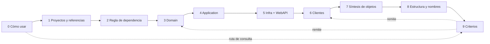

# Mesa — Ciclo 1 — Informe del especialista en Didáctica

**Fecha:** 2026-09-18
**Rol:** E-Didáctica (material técnico para principiantes)
**Mandato:** ¿el recorrido permite a alguien sin base construir los conceptos en orden, con los prerrequisitos definidos antes de usarse, con práctica intercalada y con preguntas guía que formen criterio? Proponer la secuencia pedagógica del entregable y dónde intercalar el laboratorio.
**Objeto revisado:** guía vigente `LAB/Lab-Documentos/Guides/Arquitectura/Dot-NET-Arquitectura-Guide.md` (1003 líneas) y plan `OUTPUTs/Nucleos/NC-00` a `NC-10`.
**Trabajo a ciegas:** no se leyeron otros informes de `Mesa/Ciclo-1/`.

---

## Índice

- **[1. Hallazgos](#1-hallazgos)**: siete hallazgos, con nivel de evidencia y severidad
- **[2. Secuencia pedagógica propuesta](#2-secuencia-pedagógica-propuesta)**: orden de capítulos, por qué cada uno va donde va y en qué punto entra cada práctica
- **[3. Revisado y correcto](#3-revisado-y-correcto)**
- **[4. Posición sobre DA-1..DA-4](#4-posición-sobre-da-1da-4)**: solo el aspecto didáctico
- **[5. Solicitudes de convocatoria](#5-solicitudes-de-convocatoria)**

---

## 1. Hallazgos

### D-01 — No se declara el perfil de entrada del lector, y la guía usa prerrequisitos antes de definirlos

**Severidad:** S2 · **Evidencia:** E2 + E4 · **Confianza:** 0,85

**Afirmación.** El encargo y el contrato no describen al mismo lector. Además, ni la guía vigente ni el plan fijan qué conocimientos previos se suponen.

- Prompt, Contexto §1: «permita a una persona **sin conocimientos** entender…», «el lector **no tiene experiencia en este ámbito**».
- Contrato, `objetivo`: «una persona sin experiencia en **arquitectura .NET**».

Las dos lecturas piden cosas distintas. La primera exige explicar C# y HTTP. La segunda los da por sabidos. Mientras tanto, la guía vigente usa términos que nunca define y que tampoco figuran en NC-01:

| Línea | Término usado sin definir |
|---|---|
| 58 | `DbContext`, «propiedades de navegación» |
| 137 | «EF Core Code-First», «Fluent API» |
| 245–247 | «un HTTP», «lo recibe inyectado» |
| 250 | «doble en memoria en los tests» |
| 34–56 | `private set`, constructor privado, método `static` de fábrica, `record` (l. 67), excepción propia |
| 450 | `async`/`Task`/`CancellationToken` |

La lista de NC-01 cubre el ecosistema: SDK, solución, proyecto, referencia, paquete, espacio de nombres, plantilla y DI. Deja afuera los conceptos de C# que el ejemplo usa (interfaz, `record`, modificadores de acceso, `async`) y los de la web que el laboratorio usa (HTTP, verbo, código de estado, JSON, `curl`, base de datos).

**Qué falla.** El lector que llega «sin conocimientos» se traba en la primera clase de ejemplo (`Producto`), antes de llegar a cualquier idea de arquitectura. El lector que ya sabe C# no tiene cómo saber qué partes puede saltear.

**Propuesta.**
1. En el capítulo 0, una sección «Qué se supone que sabés». Tiene que separar lo que se da por sabido (y dónde aprenderlo) de lo que la guía explica.
2. Para no dejar al lector del prompt sin la guía, conviene un **mínimo explicado dentro de ella**, con definiciones breves de *interfaz*, `record`, `private set`, `async/await`, *petición HTTP / código de estado / JSON* y *base de datos relacional*. Cada una se da en el lugar donde se usa por primera vez. Programar en C# desde cero queda fuera de alcance, declarado según el Estilo §5.3 («otra herramienta»).
3. Cada capítulo abre con una línea de **prerrequisitos**, con enlaces a las secciones donde se definieron. Esto se puede comprobar en forma mecánica: ningún término aparece antes de su definición.

---

### D-02 — La tabla «Cada objeto responde una pregunta» (NC-03) se ubica antes de los capítulos que definen sus conceptos

**Severidad:** S2 · **Evidencia:** E2 · **Confianza:** 0,8

**Afirmación.** En el grafo de NC-00 §2, NC-03 queda antes de NC-04 (Backend) y de NC-05 (Clientes) (`NC03 --> NC04`, `NC03 --> NC05`). Sin embargo, la tabla de NC-03 usa conceptos que esos núcleos, y NC-06, recién van a presentar:

- «Response DTO … Dónde vive: **Contracts**». Contracts depende de DA-2 (NC-06) y solo se justifica cuando hay un segundo cliente (NC-05).
- «ViewModel / Form model … **Front**». La página, el binding y `@bind-Value` son de NC-05.
- «Command / Query». El caso de uso y el handler son de NC-04.
- «La entidad mapeada desde afuera con **Fluent API**». EF Core y la configuración son de NC-04/NC-10.
- «WASM no tiene el ensamblado de Domain». WASM no se define hasta NC-05.

**Qué falla.** Si la tabla va en ese lugar, el lector recibe siete respuestas a preguntas que todavía no puede hacerse. Es el caso que el Estilo §1.2 describe: asentimiento sin criterio. El prompt pide para esas preguntas «una respuesta explicativa», y una explicación que se apoya en términos todavía indefinidos no le explica nada a un principiante.

**Propuesta (espiral).** Cada objeto se **presenta en el capítulo de su capa**, con su pregunta, su respuesta en una línea y el contraste ✅/❌:

| Objeto | Capítulo donde se presenta |
|---|---|
| Entity, Value Object | Domain |
| Command / Query | Application |
| Persistence model (y «la entidad se mapea desde afuera») | Infrastructure |
| Response DTO | WebAPI (como forma de la respuesta HTTP) |
| ViewModel, Form model | Clientes |

La **tabla completa**, el recorrido de ida y vuelta, «por qué no alcanza con una sola clase plana» y «cuándo la clase única es la correcta» pasan a un **capítulo de síntesis** después de Clientes. Ahí la tabla funciona como repaso y como herramienta de consulta.

---

### D-03 — El laboratorio figura como «columna», pero el plan no fija dónde se intercala cada práctica

**Severidad:** S2 · **Evidencia:** E2 + E4 · **Confianza:** 0,8

**Afirmación.**
- NC-00 §2: «NC-08 no es un capítulo aislado sino una columna que acompaña a NC-01, NC-02 y NC-04».
- NC-08, en cambio, se escribe como un bloque secuencial de 8 pasos («Recorrido propuesto»), sin asignar ningún paso a un capítulo.
- El grafo solo conecta NC-08 con NC-01, NC-02 y NC-04. Otros núcleos también piden evidencia E1 y quedan sin práctica asignada:
  - NC-03: CS0272, `Create(…, -5)`, JSON de `GET`.
  - NC-05: cliente o `curl`.
  - NC-06: `dotnet sln list` y árbol.

Según el prompt (E4), la persona tiene que poder «seguir la guía entendiendo los conceptos y **al mismo tiempo** hacer pruebas… y bajo esos conceptos entender los resultados».

**Qué falla.** Con un plan de 8 pasos seguidos, lo más probable al redactar es terminar en un capítulo «Laboratorio» al final. En ese caso el lector ve la salida lejos del concepto que la explica, y la columna «qué concepto confirma» apunta a secciones que leyó muchas páginas atrás.

**Propuesta.**
1. Regla de integración: **todo concepto con evidencia E1 tiene su práctica en el mismo capítulo, inmediatamente después de definirse**.
2. Una sola solución de laboratorio que **crece de capítulo en capítulo**. Cada práctica parte del estado en que terminó la anterior y lo declara («estado de partida: la solución de la Práctica 3 compila»).
3. Mapa de intercalación explícito en NC-00 §4 (ver §2 de este informe).
4. Un anexo «Comandos», con todos los comandos juntos, para la lectura de consulta. Es el único lugar donde el laboratorio aparece reunido.

---

### D-04 — El orden interno de NC-08 hace romper reglas antes de establecerlas y crea proyectos que el lector todavía no conoce

**Severidad:** S3 · **Evidencia:** E2 · **Confianza:** 0,9

**Afirmación.**
- NC-08, paso 4: «Romper la regla a propósito: ciclo, tipo no referenciado, **setter privado**». Paso 5: «Escribir **Producto**…». Para provocar CS0272 sobre el setter privado de `Producto`, la clase tiene que existir. En el orden propuesto, ese paso no se puede ejecutar.
- NC-08, paso 2: «Crear solución y proyectos Domain, Application, Infrastructure, WebAPI (**+ Contracts, + Tests**)». Contracts depende de una decisión abierta (DA-2) y se justifica recién con los clientes. Los tests se justifican con la inversión de dependencias (NC-02, «¿Qué gano?»).
- NC-08 pone el error antes del éxito: rompe las reglas (paso 4) antes de ver funcionar la API (paso 6).

**Qué falla.** Un principiante que crea un proyecto sin saber para qué lo toma como ritual. Romper una regla sirve como prueba solo si el lector acaba de verla cumplida: primero ve el caso válido, después el error literal, y así entiende qué protege la regla.

**Propuesta.** Cada violación se hace **justo después** de la construcción que protege:

| Construcción | Violación que la sigue |
|---|---|
| Referencias | Ciclo y CS0246 |
| `Producto` | CS0272 y `Create(-5)` |
| API funcionando | `POST` inválido → 400 |

`Contracts` y `Tests` se crean en el capítulo que los motiva. Queda corregida la inversión entre los pasos 4 y 5.

---

### D-05 — Faltan preguntas guía en la mayoría de los núcleos, y casi no hay preguntas de «cuándo no»

**Severidad:** S2 · **Evidencia:** E2 + E4 · **Confianza:** 0,85

**Afirmación.**
- **Guía vigente:** 0 comandos (`grep -c "dotnet "` = 0) y una sola sección con forma de pregunta: l. 867, «¿Dónde vive la capa de servicios?».
- **Plan:** NC-01, NC-02 y NC-07 traen preguntas guía. NC-04, NC-05, NC-06, NC-08, NC-09 y NC-10 no traen ninguna. NC-09 es el capítulo de criterios, justamente el que más las necesita.
- **Preguntas existentes:** casi todas preguntan *qué es* o *por qué es así*. Solo NC-02 («¿Qué pierdo?») apunta a *cuándo no conviene*.
- **Reglas externas (E4):**
  - Perfil Study-Guide, «Estructura de cada documento temático»: exige el punto 4, «Preguntas guía».
  - Prompt, Reglas: pide «preguntas guía acompañadas de respuestas explicativas… que permitan al lector identificar **en qué caso se aplica** cada concepto».
  - Contrato, T-04: la guía tiene que decir cuándo no conviene.

**Qué falla.** Sin la pregunta de aplicabilidad, cada capítulo presenta su patrón como obligatorio, y NC-09 queda como el único lugar donde se matiza. El lector de consulta que abre directamente el capítulo de Application no encuentra en ningún lado cuándo no hace falta un handler por caso de uso.

**Propuesta.** Cada capítulo debe cerrar con al menos una pregunta de **objeción o aplicabilidad**, con el patrón del Estilo §2.1. Algunas candidatas:

| Capítulo | Pregunta candidata |
|---|---|
| Domain | ¿Y si mi entidad no tiene ninguna regla? ¿Sigue haciendo falta un método `Create`? |
| Application | ¿Necesito MediatR para tener casos de uso? |
| Infrastructure | ¿Cuándo sí conviene un modelo de persistencia separado? |
| WebAPI | ¿Por qué el controller no valida el precio si podría? |
| Clientes | Si mi Blazor es Server, ¿por qué no llamo directamente a Application? |
| Estructura | ¿Contracts desde el día uno o cuando aparece el segundo cliente? |
| Tecnologías | ¿Qué miro antes de agregar un paquete NuGet? |

Las definiciones siguen sin llevar pregunta (Estilo §2.6).

---

### D-06 — La doble entrada (T-01) no se resuelve en el plan: no hay marco de escenarios ni un mapa de entrada para quien consulta

**Severidad:** S2 · **Evidencia:** E4 + E2 · **Confianza:** 0,75

**Afirmación.**
- El contrato reconoce la tensión (T-01: «El documento necesita ambas puertas»).
- Ningún núcleo la resuelve. NC-00 §2 pone NC-09 al final «porque exige haber entendido el resto», y ese criterio vale para el recorrido lineal, no para la consulta.
- El Perfil (E4) pide dos piezas que ningún núcleo cubre:
  - un **marco de referencia**: escenarios, contextos y actores «definidos una sola vez… y el resto de la guía los referencia»;
  - un **mapa conceptual**: «tablas de entrada… "estoy acá → qué aplico"».
- El problema conductor (Producto / Cliente / Pedido, DC-4) aparece como fuente de ejemplos, pero nunca se **plantea** como un problema a resolver. NC-09 recién habla de un «caso resuelto de punta a punta».

**Qué falla.** La persona que llega a diseñar una solución desde cero (el segundo destinatario del prompt) tiene que leer nueve capítulos antes de encontrar una sola regla de decisión. El principiante, por su parte, no tiene una situación concreta a la que asociar cada capa: aprende las capas en abstracto y se entera recién al final de para qué servían.

**Propuesta.**
1. **Capítulo 0** con dos rutas:
   - Recorrido: capítulos 1→9 con prácticas.
   - Consulta: ir al capítulo 9 y al mapa.
2. Un conjunto **estable y pequeño de escenarios**, que se definen una sola vez. Por ejemplo:
   - E-A: una sola app Blazor Server, CRUD de pocas reglas.
   - E-B: una API con varios clientes (web, escritorio).
   - E-C: base de datos heredada con esquema fijo.
   - E-D: reglas de negocio ricas que se repiten.

   Cada pregunta de «cuándo aplica» (D-05) responde en términos de esos escenarios.
3. En el capítulo 0 se **plantea** el problema conductor (qué hace el negocio, quién usa el sistema, qué clientes tiene) sin resolverlo. El capítulo 9 lo resuelve y cierra el arco.
4. Una tabla-mapa «estoy en el escenario X → qué capítulos y qué objetos aplican», ubicada en el capítulo 9 y enlazada desde el índice.

---

### D-07 — El recorrido arranca por la solución máxima; la escalera de opciones de NC-09 queda como descripción final en lugar de ser el hilo del relato

**Severidad:** S3 · **Evidencia:** E2 (la ubicación) + C (el efecto didáctico) · **Confianza:** 0,6

**Afirmación.**
- La guía vigente presenta desde la primera sección el despliegue completo. En el glosario (§1), MediatR, CQRS y Clean aparecen antes de cualquier proyecto. Application declara en l. 377 las dependencias `MediatR`, `FluentValidation` y `AutoMapper`, y después vienen Refit, MAUI y la autenticación.
- La «Escala de opciones: página→EF (Transaction Script) → capas con servicio → Clean con casos de uso → Clean + CQRS con mediador» (NC-09) aparece solo al final, como catálogo.
- El contrato registra el problema en T-04: «Recomendación dogmática vs. criterio».

**Qué falla (conjetura; se pide evidencia a la mesa, no parche).** Si el principiante ve primero la versión con todo, cada pieza le llega como un requisito y no como la respuesta a un problema. Mi hipótesis es que se entiende mejor en qué casos aplica cada escalón cuando se lo ve aparecer para resolver una limitación concreta del anterior.

**Propuesta (a decidir por el jurado).** Hay tres alternativas, de menor a mayor costo:

| Opción | En qué consiste |
|---|---|
| a | Marcar como **núcleo** lo que se construye y ejecuta (Domain, Application sin mediador, Infrastructure, WebAPI, cliente HTTP) y como **ampliación** MediatR, AutoMapper, Refit, MAUI, Shared.UI y autenticación. La ampliación va rotulada «lectura opcional; fragmento ilustrativo». |
| b | Además de (a), en el capítulo de dependencias, un contraste antes/después: la misma funcionalidad en un solo proyecto y después partida en capas, con la pregunta «¿qué cambió y qué costó?». |
| c | Hacer que el laboratorio suba la escalera paso a paso. Es la opción más cara. |

Recomiendo **(a)+(b)**. La (a) es un rótulo y no agrega contenido. La (b) toma una sola práctica y le da material concreto a la pregunta «¿qué pierdo?» de NC-02.

---

## 2. Secuencia pedagógica propuesta

Criterio de orden: **ningún término se usa antes de definirse, y ninguna práctica exige algo que todavía no se explicó.** Cuando dos capítulos se necesitan mutuamente, la dependencia se corta presentando una **versión mínima** primero y la **versión completa** después (espiral).

| # | Capítulo | Núcleos | Por qué va acá | Práctica intercalada (al final del capítulo, sobre la misma solución) |
|---|---|---|---|---|
| 0 | Cómo usar esta guía | nuevo (D-01, D-06) | Fija lector, prerrequisitos, dos rutas, escenarios E-A..E-D y **plantea** el problema conductor | P0: `dotnet --version` (o el contenedor SDK). Qué leer en la salida y qué hacer si falla |
| 1 | Qué se está armando: solución, proyecto, ensamblado, referencia, paquete, espacio de nombres | NC-01 (sin DI) | Todo lo que sigue se expresa en proyectos y referencias; es el vocabulario físico | P1: `new sln` / `classlib` / `sln add` / `add reference` / `build`. Después se rompe: CS0246 por tipo no referenciado; el namespace no crea una referencia; el ciclo es rechazado |
| 2 | La regla de dependencia | NC-02 + DI desde NC-01 | La DI se mueve acá porque solo se entiende con su motivo (DIP). Presenta *interfaz*, *inversión*, *composition root* y los anillos (DC-1). Incluye el antes/después de D-07(b) | P2: armar Domain, Application, Infrastructure y WebAPI con las referencias de la regla; `dotnet list reference`; intentar Domain→Infrastructure |
| 3 | Domain: lo que es verdad en el negocio | NC-04 (Domain) + NC-03 (Entity, VO) + NC-07 (primer uso, recuadro) | Es el centro y no depende de nada: se puede entender y probar sin base ni HTTP | P3: `Producto` y `Dinero`. Después se rompe: CS0272 al asignar el precio desde afuera; `Create(…, -5)` lanza la excepción de dominio |
| 4 | Application: lo que quiere hacer el usuario | NC-04 (Application) + NC-03 (Command/Query) | El caso de uso usa la interfaz del repositorio sin saber quién la implementa. **Antes** de EF, para que el valor de la DIP se vea puro | P4: test del handler con un repositorio en memoria (`dotnet test`). Se crea Tests acá, porque acá está su motivo |
| 5 | Infrastructure y WebAPI: el mundo real | NC-04 (Infra, WebAPI) + NC-03 (Persistence model, Response DTO) | Recién ahora EF, Fluent API ("se mapea desde afuera"), composition root, ProblemDetails. Entra HTTP con su definición mínima | P5: correr la API; `curl` POST 201, GET 200 (leer el JSON: solo los campos del DTO), POST inválido 400. Cambiar la implementación del repositorio sin tocar Domain |
| 6 | Los clientes | NC-05 + NC-03 (ViewModel, Form model) + DA-2 | La página no ve la entidad; nace la necesidad de Contracts con el segundo consumidor | P6: cliente mínimo (consola o `curl` como cliente genérico). MAUI, Shared.UI y autenticación rotulados como ampliación |
| 7 | Cada objeto responde una pregunta (síntesis) | NC-03 completo | Ahora las siete preguntas se pueden responder. Tabla, ida y vuelta, «una sola clase plana», «cuándo tu idea es la correcta» | Sin práctica nueva: cada fila remite a la práctica donde se vio |
| 8 | Estructura física y nombres | NC-06 + NC-07 | Consolida el árbol completo (DA-1) cuando todas las piezas ya son conocidas. La convención de nombres, que venía en recuadros, se enuncia como regla | P8: `dotnet sln list` y árbol real; comparación con el árbol recomendado |
| 9 | Criterios para diseñar una solución real | NC-09 | **Puerta de consulta.** Escalera de opciones, señales para subir y para no subir, mapa escenario → capítulos, resolución del problema del capítulo 0 | Ejercicio de criterio (sin comando): clasificar 3 enunciados en E-A..E-D con su respuesta explicada |
| 10 | Tecnologías y vigencia | NC-10 | Es referencia y cambia con el tiempo; se aísla para que el resto no envejezca con él | — |
| A | Anexos: glosario, comandos reunidos, lista de verificación del diseño | — | Para la consulta salteada | — |

**Por qué Application antes de Infrastructure (y no juntos, como en el orden vigente §4–§7):** el test del handler con un repositorio en memoria es la primera vez que el lector **ve** que Domain y Application funcionan sin base de datos. Si EF aparece antes, la inversión de dependencias queda como afirmación.

**Por qué la estructura física va tan tarde (en la guía vigente es §3):** el árbol completo nombra WebFront, Desktop, Shared.UI y Contracts, cuatro piezas que un principiante todavía no puede ubicar. Antes, en P2, alcanza con el árbol mínimo del backend. El árbol completo se muestra cuando ya se conocen todas sus partes.

---

## 3. Revisado y correcto

1. **El criterio de segmentación de NC-00 §1, «la unidad es la pregunta del lector»,** es el correcto para el principiante. Además hace que cada capítulo abra con una pregunta auténtica (Estilo §2.2) en lugar de un rótulo de capa.
2. **El formato de cada paso de NC-08** («objetivo, comando, salida real, cómo leerla, qué concepto confirma») cubre exactamente lo que el prompt pide: «resultados esperados… cómo analizarlos y entenderlos». Lo mismo vale para el principio de rotular como «fragmento ilustrativo» lo que no se ejecutó.
3. **NC-03 recoge el material de la conversación** («Cada objeto responde una pregunta», «la entidad es la que mapea», «por qué no alcanza una clase plana», «cuándo tu idea es la correcta») y le exige a cada pregunta el patrón pregunta → respuesta → porqué → contraste. Así satisface el primer pedido del prompt. D-02 objeta dónde se ubica ese material, no qué contiene.

---

## 4. Posición sobre DA-1..DA-4

Solo el aspecto didáctico. La decisión técnica corresponde al arquitecto y al especialista ad hoc.

- **DA-1 (Backend/ vs Clients/):** desde lo didáctico, **a favor**. La separación física enseña por sí misma que los clientes solo hablan HTTP. En el árbol vigente, `presentation/` junta WebAPI con WebFront y deja implícita justo la frontera que el lector tiene que aprender. Condición: el árbol completo se muestra en el capítulo 8, y antes solo el del backend (D-04, §2).
- **DA-2 (Contracts):** desde lo didáctico conviene que **se presente como una decisión con su criterio** («aparece con el segundo consumidor .NET»), y que no se cree por defecto en el primer paso del laboratorio (D-04). Si el jurado lo declara obligatorio, igual tiene que nacer en el capítulo 6 con su motivo.
- **DA-3, DA-4:** fuera de mandato. Solo pido que la resolución no cambie la secuencia: si MediatR o AutoMapper se quedan, que sea en el bloque de ampliación (D-07a).

---

## 5. Solicitudes de convocatoria

1. **Verificación / QA:** comprobar que el laboratorio incremental es ejecutable tal como lo propone §2, es decir, que cada estado intermedio (P1…P6) compila y corre en el contenedor SDK, y que la práctica P4 (test del handler antes de Infrastructure) no necesita referencias que todavía no existen.
2. **Arquitecto .NET:** validar que el orden propuesto (Application antes de Infrastructure, DI movida al capítulo 2, estructura física al final) no enseña ninguna relación técnicamente incorrecta. Ejemplo: que el repositorio en memoria de P4 viva en el proyecto de tests y no en Application.
