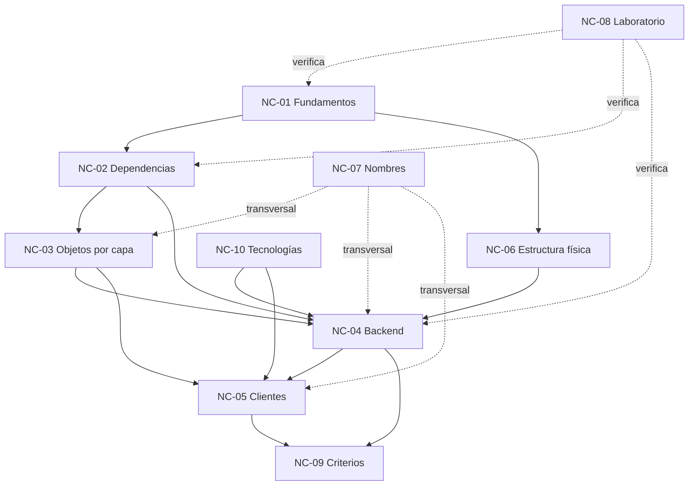

# Documento de cohesión — Núcleos conceptuales de la guía de arquitectura .NET

**Fecha:** 2026-09-18
**Función:** describir los núcleos en que se descompuso el prompt y la guía vigente, sus dependencias y la trazabilidad hacia los capítulos del entregable.

---

## 1. Criterio de segmentación

La unidad es la **pregunta del lector** que cada grupo de ideas responde, no la extensión ni el orden de la guía vigente.

| Núcleo | Pregunta del lector | Origen en la guía vigente | Origen en el prompt |
|---|---|---|---|
| NC-01 Fundamentos del ecosistema | ¿Qué es lo que estoy armando: solución, proyecto, referencia, espacio de nombres, paquete? | Implícito, nunca definido | «persona sin conocimientos» |
| NC-02 Dependencias y Clean Architecture | ¿Quién puede conocer a quién, y por qué? | §1 Clean Architecture, §13 | Conversación: capas concéntricas |
| NC-03 Los objetos de cada capa | ¿Qué clase uso para qué, si todas se parecen? | §1 glosario (Entity, VO, DTO, ViewModel, Persistence model) | «Cada objeto responde una pregunta» + respuesta explicativa |
| NC-04 El backend por proyecto | ¿Qué va en Domain, Application, Infrastructure y WebAPI? | §4–§7 | — |
| NC-05 Los clientes | ¿Cómo habla una página Blazor o MAUI con el backend? | §8–§11 | Conversación: página → servicio |
| NC-06 Estructura física de la solución | ¿Cómo ordeno carpetas y proyectos, y dónde viven los contratos? | §2, §3, §13 | DA-1, DA-2 |
| NC-07 Convención de nombres | ¿En qué idioma nombro y con qué sufijo? | disperso | DC-2 |
| NC-08 Laboratorio | ¿Cómo compruebo cada concepto con la máquina? | inexistente | «comandos que se puedan probar… resultados esperados» |
| NC-09 Criterios de diseño | Tengo un problema real: ¿qué estructura elijo y cuándo no conviene Clean? | inexistente | «guía de consulta de criterios… problema de la vida real» |
| NC-10 Decisiones tecnológicas y vigencia | ¿Qué librerías, qué versión, con qué licencia? | Resumen de decisiones | DA-3, DA-4, «no inventar» |

---

## 2. Grafo de dependencias

Lectura: NC-01 es la base de todo; NC-02 es la idea rectora; NC-08 no es un capítulo aislado sino una columna que acompaña a NC-01, NC-02 y NC-04 con comandos; NC-09 cierra porque exige haber entendido el resto.

---

## 3. Contradicciones que la integración debe resolver

| ID | Contradicción | Núcleos | Resolución |
|---|---|---|---|
| X-01 | `Contracts` «opcional» vs. front que consume DTOs de Application prohibidos por §13 | NC-05, NC-06 | Mesa (DA-2) |
| X-02 | `presentation/` mezcla WebAPI (anillo exterior del backend) con clientes independientes | NC-02, NC-06 | Mesa (DA-1) |
| X-03 | Controller de ejemplo usa `nameof(GetById)` sin definir esa acción | NC-04 | Corregir en el ejemplo (E1 al compilar) |
| X-04 | Tabla §13: WebAPI no puede referenciar Contracts, pero devuelve sus DTOs | NC-06 | Depende de DA-2 |
| X-05 | Glosario ubica DTOs en `Application/Products/DTOs/`, §5 en `Features/Productos/DTOs/` | NC-03, NC-07 | Unificar |
| X-06 | Recomendación única (Clean+CQRS+MediatR) vs. criterio de «cuándo no» | NC-09 | Capítulo de criterios |

---

## 4. Trazabilidad núcleo → capítulo del entregable

Se completa en la fase de integración (Bitácora 03).
