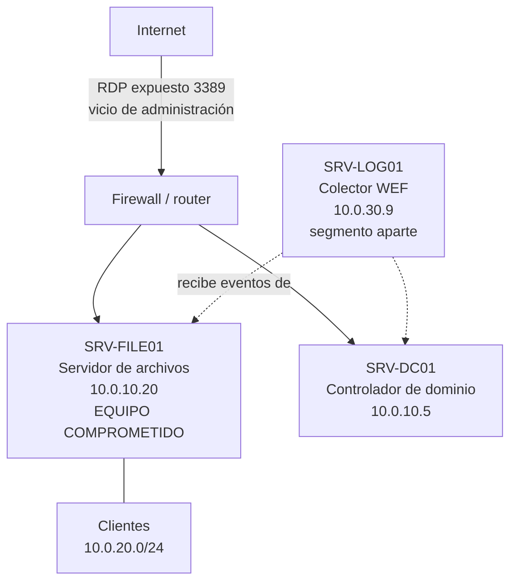

# Escenario testigo — "Servidor de archivos CONTOSO comprometido"

**Tipo:** fixture sintético coherente (single source of truth de las salidas de la guía)
**Fecha de redacción:** 2026-09-17
**Función:** reemplazar el mecanismo "salidas ilustrativas sueltas" por uno de "escenario único y coherente del que se derivan todas las salidas". Toda salida de comando de la guía debe ser consistente con este documento. Si una salida contradice el escenario, es un hallazgo de la mesa.

> **Naturaleza del escenario.** Es un caso **hipotético pero típico**, no una captura de un sistema real. Su valor no está en ser "real" sino en ser **internamente coherente**: la línea de tiempo, las cuentas, los procesos, las conexiones, los PID y los eventos encajan entre sí, de modo que las salidas que la guía muestra son las que ese sistema *produciría*. Los identificadores de red usan rangos reservados para documentación (RFC 1918 para lo interno, RFC 5737 para lo externo), como corresponde a material didáctico.

---

## 1. La organización y su red

Empresa mediana. Dominio Active Directory `CONTOSO.LOCAL` (dominio de ejemplo canónico de Microsoft; no corresponde a ninguna organización real).

| Equipo | Rol | IP | Notas |
|---|---|---|---|
| SRV-DC01 | Controlador de dominio | 10.0.10.5 | AD; no comprometido |
| **SRV-FILE01** | Servidor de archivos | 10.0.10.20 | **Equipo bajo investigación** |
| SRV-LOG01 | Colector de eventos (WEF) | 10.0.30.9 | Segmento separado; conserva la copia previa al borrado |
| Clientes | Estaciones de trabajo | 10.0.20.0/24 | — |

**Redes internas (privadas, RFC 1918):** `10.0.0.0/8`. **Externas de ejemplo (RFC 5737):** `203.0.113.0/24`.

## 2. Vicios de administración preexistentes (el terreno que habilita el ataque)

El prompt pide "una red con vicios en su administración". Se declaran tres, y de ellos se deduce todo el ataque:

1. **RDP (escritorio remoto, puerto 3389) de SRV-FILE01 expuesto a Internet** a través del firewall.
2. **Cuenta de mesa de ayuda `soporte` con privilegios de administrador local** sobre SRV-FILE01 (sobreprivilegio) y **contraseña débil**.
3. **Sin MFA** en el acceso remoto.

## 3. Cuentas relevantes

| Cuenta | Tipo | Legítima | Papel en el caso |
|---|---|---|---|
| `CONTOSO\Administrador` | Dominio | Sí | Administrador; no interviene en el ataque |
| `CONTOSO\flopez` | Dominio | Sí | Administradora de sistemas; trabaja en horario laboral |
| `CONTOSO\soporte` | Dominio | Sí (comprometida) | Mesa de ayuda; **credencial adivinada por el atacante** |
| `SRV-FILE01\svc_update` | Local | **No — creada por el atacante** | Puerta trasera con nombre que imita un servicio |

## 4. Línea de tiempo del incidente (2026-09-15)

Todas las horas en la zona local del servidor. El atacante entra de madrugada.

| Hora | Acción del atacante | Evidencia que genera |
|---|---|---|
| 03:02–03:13 | Prueba contraseñas contra `soporte` por RDP desde `203.0.113.14` | Ráfaga de eventos **4625** (fallidos) |
| 03:14:22 | Inicia sesión RDP como `CONTOSO\soporte` desde `203.0.113.14` | **4624** tipo 10; **4672** (soporte tiene admin local) |
| 03:16:05 | Crea la cuenta local `svc_update` | **4720** |
| 03:16:40 | Agrega `svc_update` al grupo Administradores local | **4732** |
| 03:20:30 | Copia `powershell`/su binario a `C:\Users\Public\update.exe` y lo ejecuta | Prefetch `UPDATE.EXE-*.pf`; proceso PID 9310 |
| 03:22:11 | Instala el servicio `WinDefendUpd` → `C:\Users\Public\update.exe` | **7045** (registro System) |
| 03:23:00 | Crea la tarea programada `\SystemUpdate` que lanza PowerShell al iniciar sesión | **4698** |
| 03:35–… | `update.exe` (PID 9310) llama a casa a `203.0.113.14:443` cada ~60 s (beaconing) | Conexión saliente; SRUM acumula tráfico |
| 03:40:11 | **Borra el registro de seguridad** con la cuenta `svc_update` | **1102** (queda como primer evento del log nuevo) |
| (continuo) | Exfiltra ~2,3 GB por el canal 443 | SRUM registra el volumen por `update.exe` |

## 5. Estado del sistema cuando el investigador llega (2026-09-17)

Consecuencia directa de la línea de tiempo. **Esto es lo que producen los comandos de la guía.**

### 5.1 Efecto del borrado de las 03:40
Al haber un **borrado total** del registro de seguridad a las 03:40 del 15/09:
- Los eventos **previos** a las 03:40 (el 4624 inicial, 4720, 4732, la ráfaga de 4625) **ya no están en el log local** de SRV-FILE01.
- El registro local **empieza** con el evento **1102** (03:40:11, sujeto `svc_update`) y sigue con lo posterior.
- Esos eventos previos **sí sobreviven en el colector WEF** `SRV-LOG01`, que los recibió en el momento.
- El `RecordId` del log local es **bajo** (se reinició con el borrado): otra señal del borrado total.

### 5.2 Salidas canónicas por comando

| Comando de la guía | Ejecutado en | Salida canónica (resumen) |
|---|---|---|
| §5.3 `Get-WinEvent Security -MaxEvents 20` | **SRV-LOG01 (colector)** | muestra 4624/4672/4720 del 15/09 03:14–03:16 (sobreviven en la copia) |
| §5.5 detección de 1102/104 | SRV-FILE01 (local) | **un** evento 1102, 15/09 03:40:11, sujeto `svc_update` |
| §5.5.1 RecordId | SRV-FILE01 (local) | `RecordId` bajos, empezando cerca de 1 tras el borrado total |
| §6.1 `Get-Process` | SRV-FILE01 | `update` PID 9310, ruta `C:\Users\Public\update.exe` |
| §6.4 servicios fuera de Windows | SRV-FILE01 | `WinDefendUpd`, Auto, `C:\Users\Public\update.exe` |
| §6.5 tareas programadas | SRV-FILE01 | `\SystemUpdate` lanza `powershell.exe` |
| §6.6 `query user` | SRV-FILE01 | sesión `soporte`, `rdp-tcp`, iniciada 15/09 03:14 |
| §7.2 conexiones externas | SRV-FILE01 | `update.exe` PID 9310 → `203.0.113.14:443` |
| §8.2 Prefetch | SRV-FILE01 | `UPDATE.EXE-*.pf`, LastWriteTime 15/09 03:20 |
| §9.2 admins locales | SRV-FILE01 | `svc_update` en Administradores (no reconocido) |

### 5.3 Cómo se resuelve el caso (cruce de indicios)
El investigador **no** ve el 4624 inicial en el log local (fue borrado), pero:
1. ve el **1102** (alguien borró el log a las 03:40 con `svc_update`, una cuenta que no reconoce);
2. ve `svc_update` en **Administradores locales** (§9.2) y su alta **4732** en la copia del colector;
3. ve `update.exe` **corriendo** desde `C:\Users\Public` (§6.1), como **servicio** (§6.4) y **tarea** (§6.5);
4. ve la **conexión saliente** a `203.0.113.14:443` (§7.2) y el **Prefetch** que prueba su ejecución (§8.2);
5. recupera del **colector WEF** el 4624 tipo 10 desde `203.0.113.14` y la ráfaga de 4625 (§5.6).

La historia cierra: acceso por RDP → creación de puerta trasera → persistencia → borrado del log → C2 y exfiltración. Ningún indicio solo alcanza; **el cruce** confirma.
