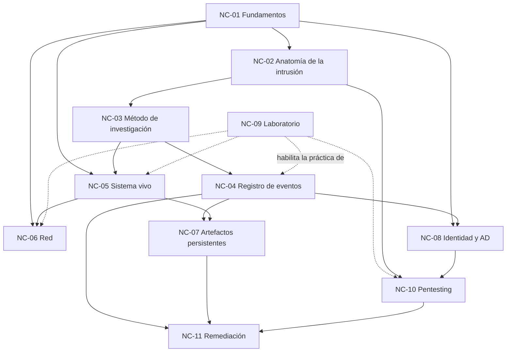

# Documento de cohesión — Núcleos conceptuales de la guía

**Fecha:** 2026-09-17
**Función:** describir las relaciones, dependencias y trazabilidad entre los núcleos conceptuales en los que
se descompuso el prompt, para permitir trabajarlos por separado sin perder el todo.

---

## 1. Criterio de segmentación

La unidad de segmentación **no es la extensión** sino la afinidad y la dependencia entre ideas. Se agruparon
por respuesta a una misma pregunta del lector:

| Núcleo | Pregunta del lector que responde |
|---|---|
| NC-01 Fundamentos | ¿Qué es esto que estoy mirando? |
| NC-02 Anatomía de la intrusión | ¿Qué hace un atacante y por qué borra los logs? |
| NC-03 Método de investigación | ¿Cómo se investiga sin arruinar la evidencia? |
| NC-04 Registro de eventos | ¿Qué quedó anotado y cómo sé si lo borraron? |
| NC-05 Sistema vivo | ¿Qué está corriendo y conectado ahora mismo? |
| NC-06 Red | ¿Con quién habla mi servidor? |
| NC-07 Artefactos persistentes | ¿Qué queda cuando los logs ya no están? |
| NC-08 Identidad y Active Directory | ¿Quién tiene poder sobre el dominio y quién se lo dio? |
| NC-09 Laboratorio | ¿Dónde practico sin romper nada? |
| NC-10 Pentesting | ¿Cómo se ve el ataque del otro lado? |
| NC-11 Remediación y endurecimiento | Encontré algo, ¿ahora qué? |

---

## 2. Grafo de dependencias

**Lectura del grafo.** NC-01 es raíz: ningún otro núcleo puede leerse sin su vocabulario. NC-03 es la
compuerta ética y metodológica: todo núcleo operativo (NC-04 a NC-08) depende de él porque ejecutar
sin método destruye evidencia. NC-09 no aporta contenido conceptual propio, habilita la ejecución
segura de los demás, por eso su arista es punteada. NC-11 es sumidero: consume los hallazgos de todos.

---

## 3. Matriz de dependencias y riesgos de integración

| Núcleo | Depende de | Aporta a | Riesgo de integración |
|---|---|---|---|
| NC-01 | — | todos | Inflarse hasta volverse un manual de sistemas operativos |
| NC-02 | NC-01 | NC-03, NC-10 | Quedar en taxonomía abstracta sin anclar en lo observable |
| NC-03 | NC-02 | NC-04..NC-08 | Sonar burocrático y que el lector lo saltee |
| NC-04 | NC-03 | NC-07, NC-08, NC-11 | Convertirse en listado de Event IDs sin criterio |
| NC-05 | NC-01, NC-03 | NC-06, NC-07 | Confundir "muestreo" con "monitoreo continuo" |
| NC-06 | NC-01, NC-05 | NC-11 | Requerir equipamiento que el lector no tiene |
| NC-07 | NC-04, NC-05 | NC-11 | Exigir herramientas forenses que el lector no sabe usar |
| NC-08 | NC-01, NC-04 | NC-10, NC-11 | Presuponer conocimiento de Active Directory |
| NC-09 | NC-01 | NC-04..NC-10 | Costo de montaje que desaliente la práctica |
| NC-10 | NC-02, NC-08, NC-09 | NC-11 | Leerse como recetario ofensivo sin encuadre de autorización |
| NC-11 | NC-04, NC-07, NC-10 | — | Prometer remediación total en una guía introductoria |

---

## 4. Terminología unívoca (contrato entre núcleos)

Términos que aparecen en más de un núcleo y deben usarse con un solo sentido en todo el documento:

| Término | Sentido único adoptado | Dónde se define |
|---|---|---|
| **Evento** | Registro individual dentro de un log de Windows, con su identificador numérico | NC-01 |
| **Artefacto** | Rastro que el sistema deja como efecto secundario de su funcionamiento, no con intención de auditar | NC-07 |
| **Indicador de compromiso (IoC)** | Dato observable y concreto asociado a una actividad maliciosa | NC-02 |
| **Línea de base (baseline)** | Registro de cómo se ve el sistema cuando se lo considera sano | NC-03 |
| **Triage** | Recolección rápida y ordenada de evidencia para decidir si hay incidente | NC-03 |
| **Persistencia** | Mecanismo por el cual el atacante sobrevive a un reinicio | NC-02 |
| **Telemetría** | Flujo continuo de datos de actividad enviado fuera del equipo que lo genera | NC-04 |

---

## 5. Trazabilidad núcleo → capítulo del entregable

| Núcleo | Capítulo previsto |
|---|---|
| NC-01 | §2 El terreno: qué es una red Windows |
| NC-02 | §3 Cómo trabaja un intruso |
| NC-03 | §4 Cómo se investiga sin destruir la evidencia |
| NC-04 | §5 El registro de eventos |
| NC-05 | §6 El sistema vivo |
| NC-06 | §7 La red |
| NC-07 | §8 Artefactos que sobreviven al borrado |
| NC-08 | §9 Identidad y Active Directory |
| NC-09 | §10 Laboratorio de práctica |
| NC-10 | §11 Pentesting |
| NC-11 | §12 Qué hacer con lo encontrado |
