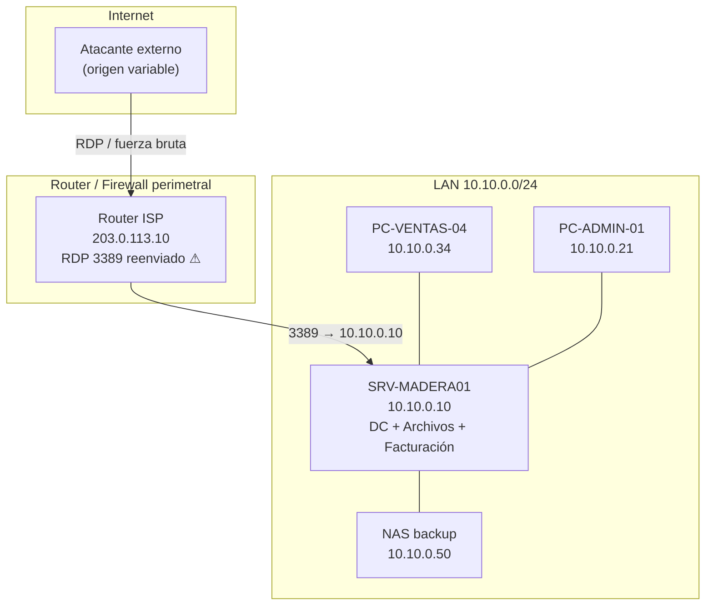
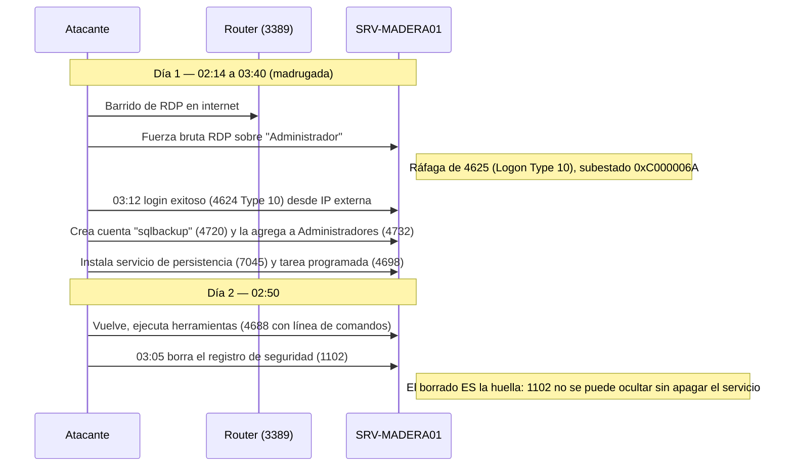

# Escenario testigo — «MADERERA DEL SUR»

## Resumen ejecutivo

Este documento define el **escenario testigo**: un servidor Windows Server 2019 ficticio pero internamente coherente, con su organización, su red, su inventario, su línea de base de operación normal y una cronología de intrusión. No describe un sistema real. Su función es servir de **fuente única de verdad** para todas las salidas ilustrativas de la guía `Beginning-Security-Windows-Network-Guide.md` y del cuadernillo de ejercicios: cuando la guía muestra la forma de la salida de un comando, esa salida es consistente con los datos que se fijan acá.

El escenario resuelve la tensión T-02 del contrato de entrada (`BIT-01-CONTRATO`): como no hay un Windows real donde capturar salidas, se construye un modelo verificable contra el cual las salidas ilustrativas son coherentes entre sí. Todo dato de este escenario es **sintético**; los nombres de personas, equipos, direcciones IP y horarios son inventados para el material didáctico.

> **Aviso.** Nada de lo que sigue corresponde a una organización, persona o infraestructura reales. Las direcciones IP pertenecen a rangos privados (RFC 1918) y los identificadores son ilustrativos.

---

## 1. La organización

«Maderera del Sur» es una PyME de 40 empleados que vende insumos de madera. Tiene un único servidor físico que concentra el dominio de Active Directory, el archivo compartido de la empresa y la aplicación de facturación. La administración del servidor la hizo, durante años, un técnico externo que ya no trabaja con la empresa; quedaron **vicios de administración** típicos: cuentas de servicio con privilegios de más, contraseñas que no expiran, RDP publicado, y una política de auditoría en su configuración de fábrica.

El disparador del caso: el encargado administrativo nota que **el sistema de facturación estuvo lento**, que una carpeta compartida apareció con archivos renombrados, y sospecha —sin poder probarlo— que «alguien entró». Además cree que **se borraron registros**. No hay personal de seguridad; la persona que audita es alguien de soporte con acceso al servidor y **sin formación previa en redes ni en seguridad**. Ese es el lector de la guía.

---

## 2. Topología de red

El vicio central está en el perímetro: el router del proveedor de internet **reenvía el puerto 3389 (RDP) directamente al servidor**, de modo que el escritorio remoto del servidor queda expuesto a todo internet. Es la puerta por la que entra el atacante del caso.

---

## 3. Inventario del servidor

| Atributo | Valor |
|---|---|
| Nombre de equipo (hostname) | `SRV-MADERA01` |
| Sistema operativo | Windows Server 2019 Standard (build 17763) |
| Dominio Active Directory | `maderasur.local` |
| Rol | Controlador de dominio (AD DS), DNS, servidor de archivos (SMB), host de la app de facturación |
| Dirección IP | `10.10.0.10/24` |
| PowerShell | 5.1 (nativo del sistema) |
| RDP | Habilitado y publicado a internet (vicio) |
| Antimalware | Microsoft Defender (estado por verificar en la auditoría) |
| Política de auditoría | Configuración de fábrica (vicio: eventos clave sin registrar) |

### 3.1 Cuentas y grupos (línea de base)

| Cuenta | Tipo | Observación de línea de base |
|---|---|---|
| `Administrador` | Administrador local/dominio | Contraseña sin expiración (vicio) |
| `svc_facturacion` | Cuenta de servicio | En `Domain Admins` sin necesitarlo (vicio) |
| `jperez` | Usuario (administración) | Uso diurno, PC-ADMIN-01 |
| `mgomez` | Usuario (ventas) | Uso diurno, PC-VENTAS-04 |
| `soporte` | Usuario (el lector) | Alta reciente, acceso al servidor para auditar |
| 36 cuentas más | Usuarios | Personal de la empresa |

**Grupos privilegiados esperados** (`Domain Admins`, `Administrators`): `Administrador`, `svc_facturacion` (vicio). Cualquier miembro fuera de esa lista es sospechoso.

---

## 4. Cronología de la intrusión (verdad del escenario)

El lector **no conoce** esta cronología al empezar: es lo que debe reconstruir con la guía. Se documenta acá para que las salidas ilustrativas sean coherentes y para que el cuadernillo tenga una clave de corrección.

### 4.1 Indicadores por fase (mapa síntoma → artefacto)

| Fase de la intrusión | Síntoma observable | Artefacto / evento nativo |
|---|---|---|
| Fuerza bruta RDP | Ráfaga de fallos de logon de madrugada | Muchos `4625` Logon Type 10, subestado `0xC000006A` (usuario no existe) / `0xC000006D` |
| Acceso conseguido | Logon exitoso remoto fuera de horario, IP externa | `4624` Logon Type 10 desde IP pública |
| Creación de puerta trasera | Cuenta nueva no inventariada | `4720` (alta) + `4732` (agregada a Administradores) |
| Persistencia | Servicio y tarea desconocidos | `7045` (System) + `4698` (tarea programada) |
| Ejecución de herramientas | Procesos anómalos con línea de comando sospechosa | `4688` con `CommandLine` (si la GPO lo habilita) |
| Antiforense | «Desaparecieron» los registros | `1102` (borrado del log de Seguridad); hueco temporal en los logs |
| Conexión de mando | Conexión saliente a IP/puerto raro | `Get-NetTCPConnection` / `netstat -ano`; Sysmon Event ID 3 si está instalado |

El hallazgo que ancla todo el caso es el **1102**: el atacante borró el registro de seguridad creyendo taparse, pero el propio acto de borrado genera un evento que Windows escribe **después** de vaciar el log, y que no puede suprimirse sin detener el servicio de registro de eventos (lo que a su vez deja el `1100`/`104`). Enseñar a leer ese evento es el corazón didáctico del caso.

---

## 5. Qué debe descubrir el lector

Al terminar la investigación guiada, el lector tendría que poder afirmar, con evidencia:

1. Hubo **fuerza bruta de RDP** desde una IP externa entre las 02:14 y las 03:12 del Día 1.
2. Esa fuerza bruta **tuvo éxito** (un 4624 Type 10 tras cientos de 4625).
3. El atacante **creó una cuenta de puerta trasera** (`sqlbackup`) y la volvió administradora.
4. Instaló **persistencia** (servicio + tarea programada).
5. **Borró el registro de seguridad** para tapar los pasos anteriores — y ese borrado es, en sí mismo, la prueba de que hubo manipulación.
6. La causa raíz es un **vicio de administración**: RDP publicado a internet + política de auditoría de fábrica + cuentas privilegiadas de más.

---

## 6. Relación con el resto de la guía

- El **corpus de evidencia** (`ESC-CORPUS`) contiene los fragmentos ilustrativos de logs y salidas que este escenario justifica.
- La **guía principal** (`GUIA-PRINCIPAL`) usa este escenario como hilo conductor: cada herramienta nativa se presenta resolviendo un tramo del caso.
- El **cuadernillo** (`CUADERNO`) plantea ejercicios cuya clave de corrección es la sección 4 de este documento.

## 7. Preguntas guía

**¿Por qué construir un escenario ficticio en vez de usar salidas genéricas?**
Porque un conjunto de salidas inventadas al azar se contradice entre sí —una muestra un logon a las 03:12 y otra no lo refleja— y esa incoherencia le enseña mal al lector. Un escenario único hace que todo lo que la guía muestra sea derivable de un mismo modelo y, por lo tanto, internamente verificable.

**¿Por qué el evento 1102 es el ancla del caso y no el 4624 del login del atacante?**
Porque un atacante hábil borra o adultera muchas huellas, pero el borrado del registro de seguridad es un acto que Windows registra por diseño de forma difícil de suprimir. Enseñar a buscar primero la evidencia de manipulación (1102, huecos temporales) forma el criterio correcto: en un sistema comprometido, la ausencia de registros es en sí misma un dato.
