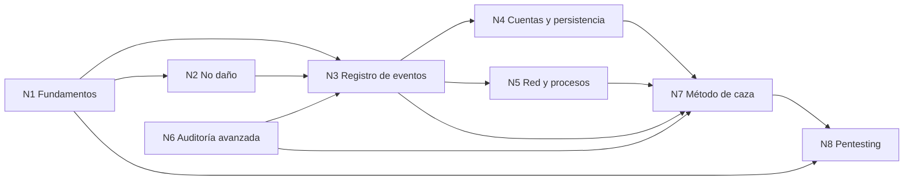

# Descomposición conceptual y cohesión global

## Resumen ejecutivo

La regla de descomposición conceptual del prompt pide segmentar el trabajo por **afinidad y dependencia entre ideas**, no por extensión, y mantener un documento de cohesión que describa las relaciones entre los núcleos. Este documento es ese mapa. Cada núcleo se desarrolla en su propio archivo (`N1`…`N8`) y se integra después en un único entregable autocontenido: la guía no se publica fragmentada en ocho archivos, sino que los núcleos son el **andamiaje de análisis** con el que se ordena la redacción y con el que la mesa evaluadora verifica cobertura.

---

## 1. Los ocho núcleos

| ID | Núcleo | Pregunta que resuelve | Sección de la guía |
|----|--------|-----------------------|--------------------|
| N1 | Fundamentos de una red Windows | ¿Qué es lo que estoy auditando? (dominio, AD, SMB, RDP, usuarios, logon) | 1–2 |
| N2 | Reglas de no daño y evidencia | ¿Qué NO hacer para no destruir la prueba? (orden de volatilidad) | 3 |
| N3 | El registro de eventos | ¿Dónde queda escrito lo que pasó y cómo lo leo? (Visor, Get-WinEvent, IDs de logon, 1102) | 4–5 |
| N4 | Cuentas y persistencia | ¿Dejó el intruso una puerta abierta? (usuarios nuevos, servicios, tareas) | 6 |
| N5 | Red y procesos vivos | ¿Hay algo conectado o corriendo ahora mismo? (conexiones, procesos, sesiones) | 7 |
| N6 | Auditoría avanzada y telemetría | ¿Cómo hago que el sistema registre lo que hoy no registra? (política avanzada, 4688, Sysmon) | 8 |
| N7 | Método de caza e integración | ¿Cómo junto todo en un relato con evidencia? (línea de tiempo, MITRE ATT&CK, checklist) | 9 |
| N8 | Pentesting reproducible | ¿Cómo se ve esto desde el lado del atacante, en un laboratorio? (ética, lab, herramientas, vista defensiva) | 10–11 |

---

## 2. Grafo de dependencias

**Lectura del grafo.** N1 es prerrequisito de todo: sin entender qué es un dominio o un logon, ningún evento significa nada. N2 se cruza antes de tocar el sistema, porque el orden de recolección condiciona qué evidencia sobrevive. N3 es el eje central —el registro de eventos— del que se ramifican N4 y N5. N6 (auditoría avanzada) alimenta a N3: mejora lo que el registro captura. N7 integra los hallazgos en un relato. N8 reutiliza N1 y N7 para mirar el mismo sistema desde el atacante.

---

## 3. Vocabulario común (definido una vez, referenciado en todos)

Términos que aparecen en varios núcleos y se definen en N1 para no repetir: *dominio*, *Active Directory*, *controlador de dominio*, *SMB*, *RDP*, *cuenta de servicio*, *logon type*, *SID*, *privilegio*, *canal de log*, *evento*, *línea de base*, *indicador de compromiso (IoC)*, *persistencia*, *movimiento lateral*.

---

## 4. Trazabilidad núcleo → escenario → evidencia

Cada núcleo se ancla en el escenario testigo (`ESC-TESTIGO`) y produce salidas ilustrativas que viven en el corpus (`ESC-CORPUS`):

| Núcleo | Tramo del caso que resuelve | Evidencia que usa |
|--------|-----------------------------|-------------------|
| N3 | Detectar la fuerza bruta y el login del atacante | 4625 en ráfaga, 4624 Type 10, 1102 |
| N4 | Encontrar la cuenta `sqlbackup` y la persistencia | 4720/4732, 7045, 4698 |
| N5 | Ver la conexión de mando activa | `Get-NetTCPConnection`, `netstat -ano` |
| N6 | Explicar por qué faltan datos y cómo mejorarlo | política de auditoría de fábrica, 4688 sin línea de comando |
| N7 | Reconstruir la línea de tiempo completa | correlación de todos los anteriores |
| N8 | Reproducir el ataque en laboratorio | fuerza bruta RDP, creación de cuenta, borrado de log |

---

## 5. Fase de integración

Terminados los núcleos, la integración (Fase 3 del plan) resuelve:

- **Solapamientos**: el evento 4624 aparece en N3 y N5; se define en N3 y N5 lo referencia.
- **Contradicciones de nivel**: N8 (ofensivo) no puede contradecir el encuadre de N2 (no daño); el pentesting se confina al laboratorio.
- **Huecos**: si un tramo del caso del escenario no tiene núcleo que lo cubra, falta contenido. La mesa verifica esta cobertura al cierre.

El resultado de la integración es un único documento-guía + un cuadernillo, ambos autocontenidos.
